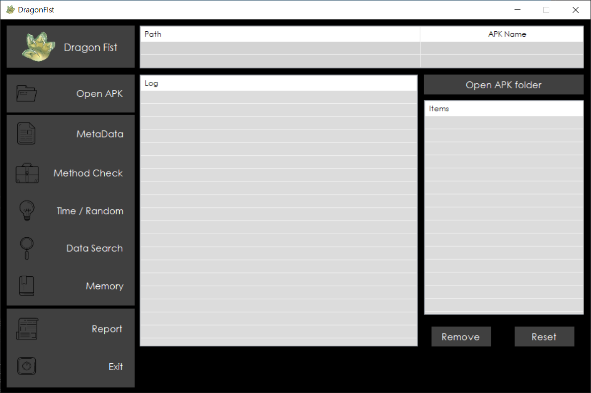

# DragonFist

DragonFist is an automated tool for checking vulnerability and making report on Unity Engine based Games. This program works in Android environment and also supports Android emulator environment. It can check vulnerability from the attacker's point of view and provide details of vulnerability and solutions.

For user-friendly environment, DragonFist is created with GUI(Graphical User Interface)

## Features

- Decompile APK and Restore metadata automatically
- Check Method Vulnerability by auto-hooking it dynamically 
- Check Time & Random Vulnerability by manipulating it directly
- Check Saving data with the format of SQLite3 and PlayerPrefs
- Check Memory Vulnerability using Value search, Class search
- Make Vulnerablility Analysis Report automatically

## Environment

1. IDE : Visual Studio 2019
2. Language : C#
3. Form : Windows Form

## Pre-Installation

1. Android SDK Platform Tools(adb.exe) : https://developer.android.com/studio/releases/platform-tools
2. Python3 : https://www.python.org/downloads/windows
3. Java JDK : https://www.oracle.com/technetwork/java/javase/downloads/index.html
4. Frida(Windows) : https://frida.re/docs/installation,
5. Frida-server(Android) : https://github.com/frida/frida/releases
6. .NET Framework : https://dotnet.microsoft.com/download/dotnet-framework

## Install

There are 2 ways to install DragonFist.

1. Git clone or Download ZIP
2. Install by [installer](https://drive.google.com/drive/folders/10sOFgc13zDs95SP6lMBSI6AXTE1OOFL5)

## How to use

DragonFist provides User-Manual and FAQ

1. [DragonFist_UserManual](./FAQ&Manual/DragonFist_UserManual.pdf)
2. [DragonFist_FAQ](./FAQ&Manual/DragonFist_FAQ.pdf)

## Reference

1. Il2CppDumper : https://github.com/Perfare/Il2CppDumper
2. apktool : https://bitbucket.org/iBotPeaches/apktool/
